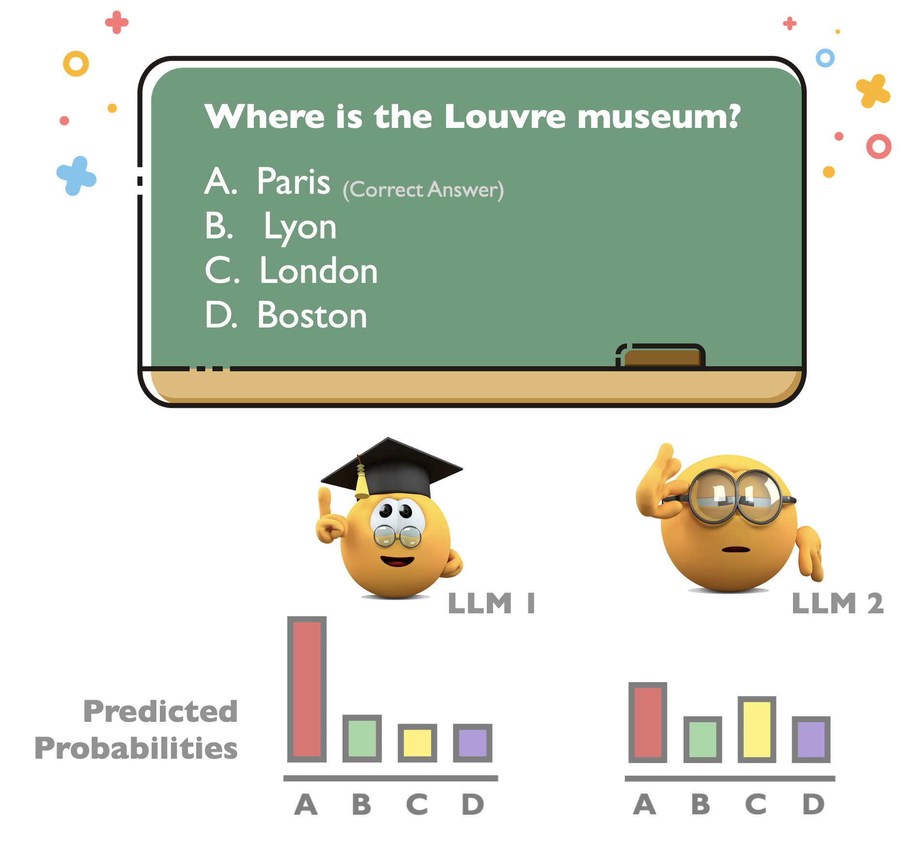
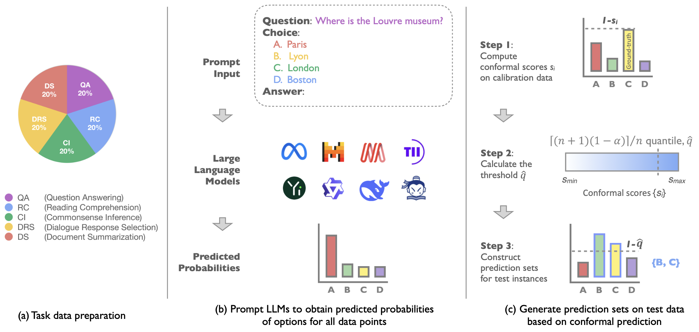
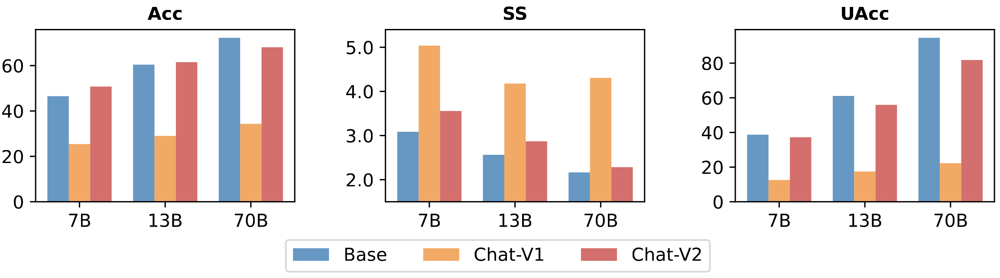
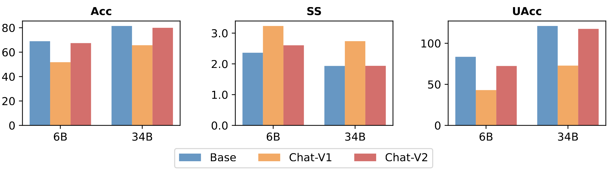
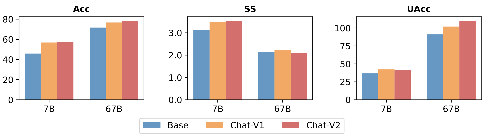
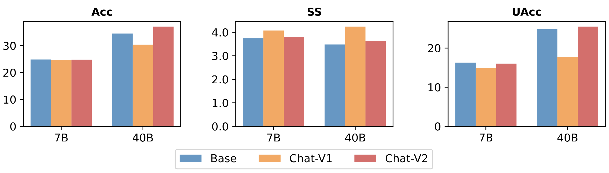

<div align="center">

# Benchmarking LLMs via Uncertainty Quantification

 
 
 

  
 
 
 


📰 [Paper](https://arxiv.org/abs/2401.12794), :card_file_box: [Datasets](https://huggingface.co/datasets/ErikYip/LLM-Uncertainty-Bench/tree/main)

</div>

## 1. Introduction
The proliferation of open-source Large Language Models (LLMs) from various institutions has highlighted the urgent need for comprehensive evaluation methods. However, current evaluation platforms, such as the widely recognized HuggingFace open LLM leaderboard, neglect a crucial aspect -- **uncertainty**, which is vital for thoroughly assessing LLMs. 

<p align="center">
  
  <p align="center">Two LLMs can achieve the same accuracy score but demonstrate different levels of uncertainty.</p>
</p>

To bridge this gap, we introduce a new benchmarking approach for LLMs that integrates uncertainty quantification. Our examination involves eight LLMs (LLM series) spanning five representative natural language processing tasks. Additionally, we introduce an uncertainty-aware evaluation metric, UAcc, which takes into account both prediction accuracy and prediction uncertainty. Our findings reveal that: 

* **LLMs with higher accuracy may exhibit lower certainty**;
* **Larger-scale LLMs may display greater uncertainty compared to their smaller counterparts**;
* **Instruction-finetuning tends to increase the uncertainty of LLMs**.
  
By taking uncertainty into account, our new UAcc metric can either amplify or diminish the relative improvement of one LLM over another and may even change the relative ranking of two LLMs, thus underscoring the significance of incorporating uncertainty in the evaluation of LLMs.


## 2. Uncertainty Quantification
We propose the utilization of [conformal prediction](https://arxiv.org/abs/2107.07511) for uncertainty quantification in LLMs. Compared to other methods, conformal prediction offers multiple advantages including ease of implementation, high efficiency, and a statistically **rigorous** estimation of uncertainty rather than a heuristic approximation.

<p align="center">
  
  <p align="center">The overall process of applying conformal prediction for uncertainty quantification in LLMs.</p>
</p>


## 3. Evaluation Tasks and Datasets
In order to evaluate the performance of LLMs comprehensively, we consider five typical NLP tasks and prepare a dataset with **10,000** instances for each task.

* **Question Answering (QA):** QA is applied to evaluate an LLM's proficiency in utilizing its extensive world knowledge to provide accurate answers to a diverse range of questions. For this task, we construct the evaluation dataset based on [MMLU](https://arxiv.org/abs/2009.03300).
* **Reading Comprehension (RC):** RC is used for testing an LLM's ability to understand and analyze a given context, and answer questions based on the information presented in the context. For this task, we construct the evaluation dataset based on [CosmosQA](https://arxiv.org/abs/1909.00277).
* **Commonsense Inference (CI):** CI is leveraged to evaluate the ability of LLMs to understand and reason about the relationships between concepts and events based on commonsense and background knowledge. For this task, we construct the evaluation dataset based on [HellaSwag](https://arxiv.org/abs/1905.07830).
* **Dialogue Response Selection (DRS):** DRS is adopted for assessing the ability of LLMs to comprehend the meaning of a given dialogue and select an appropriate response from a set of possible responses. For this task, we construct the evaluation dataset based on [HaluEval](https://arxiv.org/abs/2305.11747).
* **Document Summarization (DS):** DS is taken to evaluate the proficiency of LLMs in comprehending the substance and context of a given document, and in producing a succinct and cohesive summary that effectively conveys the crucial information and main ideas of the document. For this task, we construct the evaluation dataset based on [HaluEval](https://arxiv.org/abs/2305.11747).

We formulate each task as a multiple-choice question answering (MCQA) task and the objective is to select the _only_ correct answer out of possible options.


## 4. Evaluation Results

### Pretrained Base LLMs

We first compare the performance of various LLMs in terms of prediction accuracy (**Acc**), which measures the proportion of test instances whose true label has the highest predicted probability.

| LLMs | QA | RC | CI | DRS | DS | Avg. |
| ----- | :-----: | :-----: | :-----: | :-----: | :-----: | :-----: | 
| Yi-34B | 71.24 | 94.48 | 93.98 | 76.12 | 71.47 | 81.46 |
| Qwen-72B | 72.53 | 91.86 | 88.09 | 77.13 | 60.63 | 78.05 |
| Qwen-14B | 64.25 | 91.52 | 91.00 | 73.90 | 49.33 | 74.00 |
| Llama-2-70B | 65.86 | 89.30 | 81.62 | 67.03 | 57.41 | 72.24 |
| DeepSeek-67B | 67.97 | 88.66 | 70.82 | 74.67 | 56.20 | 71.66 |
| Yi-6B | 57.57 | 85.99 | 76.50 | 58.72 | 66.06 | 68.97 |
| Mistral-7B | 60.44 | 81.94 | 62.93 | 53.21 | 62.16 | 64.14 |
| Llama-2-13B | 52.52 | 77.23 | 59.66 | 52.65 | 60.05 | 60.42 |
| Qwen-7B | 55.21 | 83.89 | 63.70 | 64.04 | 32.53 | 59.87 |
| InternLM-7B | 48.37 | 73.86 | 46.21 | 43.72 | 34.38 | 49.31 |
| Llama-2-7B | 45.60 | 65.79 | 43.05 | 32.61 | 45.60 | 46.53 |
| DeepSeek-7B | 45.65 | 65.39 | 42.66 | 33.50 | 42.15 | 45.87 |
| Qwen-1.8B | 44.78 | 64.14 | 36.53 | 35.48 | 30.77 | 42.34 |
| Falcon-40B | 40.16 | 48.11 | 25.98 | 27.25 | 31.01 | 34.50 |
| MPT-7B | 29.49 | 31.69 | 25.50 | 24.38 | 24.86 | 27.18 |
| Falcon-7B | 23.75 | 24.98 | 24.91 | 25.86 | 24.69 | 24.84 |

We then compare the performance of various LLMs in terms of prediction uncertainty, which is measured as the average size of prediction sets of all test instances (**SS**). Note that a larger set size indicates higher uncertainty.

| LLMs | QA | RC | CI | DRS | DS | Avg. |
| ----- | :-----: | :-----: | :-----: | :-----: | :-----: | :-----: | 
| Yi-34B | 2.60 | 1.71 | 1.90 | 1.77 | 1.69 | 1.93 |
| Qwen-72B | 2.45 | 1.90 | 1.80 | 2.09 | 2.06 | 2.06 |
| Qwen-14B | 2.80 | 1.74 | 2.02 | 1.94 | 2.37 | 2.17 |
| Llama-2-70B | 2.62 | 1.78 | 1.82 | 2.34 | 2.25 | 2.16 |
| DeepSeek-67B | 2.65 | 1.54 | 2.43 | 1.89 | 2.25 | 2.15 |
| Yi-6B | 3.20 | 1.92 | 1.88 | 2.85 | 1.96 | 2.36 |
| Mistral-7B | 2.80 | 1.75 | 2.48 | 2.71 | 2.40 | 2.43 |
| Llama-2-13B | 3.06 | 2.24 | 2.72 | 2.55 | 2.24 | 2.56 |
| Qwen-7B | 3.26 | 2.15 | 2.28 | 2.51 | 2.92 | 2.63 |
| InternLM-7B | 3.49 | 2.19 | 3.28 | 3.63 | 4.47 | 3.41 |
| Llama-2-7B | 3.20 | 2.39 | 3.27 | 3.26 | 3.30 | 3.09 |
| DeepSeek-7B | 3.34 | 2.77 | 3.06 | 3.40 | 3.08 | 3.13 |
| Qwen-1.8B | 3.20 | 2.58 | 3.49 | 3.45 | 4.18 | 3.38 |
| Falcon-40B | 3.25 | 3.12 | 3.54 | 3.59 | 3.89 | 3.48 |
| MPT-7B | 3.53 | 3.46 | 3.60 | 3.59 | 3.66 | 3.57 |
| Falcon-7B | 3.90 | 3.60 | 3.66 | 3.64 | 3.92 | 3.75 |

In addition, we propose a new evaluation metric, Uncertainty-aware Accuracy (**UAcc**), which takes into account both prediction accuracy and prediction uncertainty.
<p align="center">
  
</p>
Note that UAcc can take values greater than 1. 


| LLMs | QA | RC | CI | DRS | DS | Avg. |
| ----- | :-----: | :-----: | :-----: | :-----: | :-----: | :-----: | 
| Yi-34B | 71.10 | 163.56 | 156.37 | 108.12 | 106.31 | 121.09 |
| Qwen-72B | 80.24 | 152.50 | 146.12 | 96.04 | 74.92 | 109.96 |
| Qwen-14B | 57.83 | 157.52 | 147.13 | 97.70 | 51.22 | 102.28 |
| Llama-2-70B | 65.20 | 149.22 | 124.20 | 71.98 | 62.50 | 94.62 |
| DeepSeek-67B | 66.38 | 153.27 | 73.10 | 100.97 | 61.64 | 91.07 |
| Yi-6B | 45.18 | 132.61 | 103.41 | 50.97 | 85.49 | 83.53 |
| Mistral-7B | 54.60 | 124.71 | 62.45 | 48.18 | 64.25 | 70.84 |
| Llama-2-13B | 42.53 | 92.46 | 53.82 | 50.52 | 66.02 | 61.07 |
| Qwen-7B | 42.45 | 118.10 | 69.47 | 64.42 | 27.28 | 64.34 |
| InternLM-7B | 34.17 | 86.84 | 34.56 | 29.73 | 18.87 | 40.83 |
| Llama-2-7B | 34.97 | 67.92 | 32.25 | 24.50 | 33.91 | 38.71 |
| DeepSeek-7B | 33.63 | 58.50 | 34.23 | 24.11 | 33.52 | 36.80 |
| Qwen-1.8B | 34.36 | 61.55 | 25.59 | 25.22 | 18.04 | 32.95 |
| Falcon-40B | 30.32 | 37.86 | 17.98 | 18.60 | 19.52 | 24.85 |
| MPT-7B | 20.44 | 22.43 | 17.36 | 16.66 | 16.63 | 18.70 |
| Falcon-7B | 14.90 | 17.01 | 16.66 | 17.41 | 15.42 | 16.28 |


### Instruction-Finetuned Chat LLMs

We adopt two methods to prepare the prompt input for instruction-finetuned LLMs. The first method aligns with the format of the instruction data (denoted as **Chat-V1**). This method aims to evaluate the LLM’s proficiency in adhering to instructions to accomplish tasks. The second method employs the same prompt format as the base version (denoted as **Chat-V2**). This method aims to assess the extent of the base LLM’s capabilities retained after instruction-finetuning.

<p align="center">
  
  <p align="center">Mean performance outcomes of the Llama-2 series’ pretrained base model and the instruction-finetuned chat model across five tasks.</p>
</p>


<details>
  <summary>Click to view results of the Yi series</summary>
  <p align="center">
  
  </p>
</details>

<details>
  <summary>Click to view results of the DeepSeek series</summary>
  <p align="center">
  
  </p>
</details>

<details>
  <summary>Click to view results of the Falcon series</summary>
  <p align="center">
  
  </p>
</details>


## 5. Usage

### Installation
We have used `Python 3.10.13` with the following dependencies.
```shell
pip install -r requirements.txt
```

### Get Option Logits from LLMs
We prompt LLMs to obtain logit outputs corresponding to all options (i.e. A, B, C, D, E, and F).
```shell
python generate_logits.py \
  --model={path to model directory} \
  --data_path={path to data directory} \
  --file={name of dataset} \
  --prompt_method={base/shared/task} \
  --output_dir={output directory} \
  --few_shot={1 for few-shot and 0 for zero-shot}
```

or 

```shell
python generate_logits_chat.py \
  --model={path to model directory} \
  --data_path={path to data directory} \
  --file={name of dataset} \
  --prompt_method={base/shared/task} \
  --output_dir={output directory} \
  --few_shot={1 for few-shot and 0 for zero-shot}
```
for chat version.

### Apply Conformal Prediction for Uncertainty Quantification
We split each dataset into a calibration set and a test set, and apply conformal prediction to obtain prediction sets for all test set instances.

```shell
python uncertainty_quantification_via_cp.py \
  --model={model name} \
  --raw_data_dir={path to data directory} \
  --logits_data_dir={path to directory where option logits are stored} \
  --data_names={list of datasets to be evaluated} \
  --cal_ratio={how much data to be used as the calibration data, e.g., 0.5} \
  --alpha={error rata, e.g., 0.1} 
```

Take Qwen-72B as an example, we have
```shell
python uncertainty_quantification_via_cp.py \
  --model=Qwen-72B \
  --raw_data_dir=data \
  --logits_data_dir=outputs_base \
  --cal_ratio=0.5 \
  --alpha=0.1 
```
```
mmlu_10k_Acc: 72.53 
cosmosqa_10k_Acc: 91.86 
hellaswag_10k_Acc: 88.09 
halu_dialogue_Acc: 77.13 
halu_summarization_Acc: 60.63 
Average acc: 78.05 
mmlu_10k_SS: 2.45 
cosmosqa_10k_SS: 1.90 
hellaswag_10k_SS: 1.80 
halu_dialogue_SS: 2.09 
halu_summarization_SS: 2.06 
Average SS: 2.06 
mmlu_10k_Coverage Rate: 93.43 
cosmosqa_10k_Coverage Rate: 95.79 
hellaswag_10k_Coverage Rate: 93.99 
halu_dialogue_Coverage Rate: 93.02 
halu_summarization_Coverage Rate: 90.41 
Average Coverage Rate: 93.33 
mmlu_10k_UAcc: 80.24 
cosmosqa_10k_UAcc: 152.50 
hellaswag_10k_UAcc: 146.12 
halu_dialogue_UAcc: 96.04 
halu_summarization_UAcc: 74.92 
Average UAcc: 109.96
```


## 6. Citation

```bibtex
@article{ye2024llm_uq,
  title={Benchmarking LLMs via Uncertainty Quantification},
  author={Ye, Fanghua and Yang MingMing and Pang, Jianhui and Wang, Longyue and Wong, Derek F and Yilmaz Emine and Shi, Shuming and Tu, Zhaopeng},
  journal={arXiv preprint arXiv:2401.12794},
  year={2024}
  }
```


## 7. Contact
If you have any questions, feel free to raise an issue ro contact us at <fanghua.ye.21@gmail.com>.
